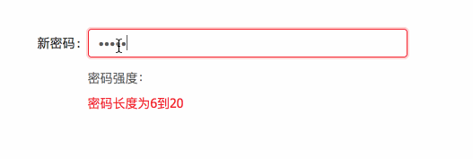

# verify-pwd-strength





## 用于验证密码框强弱度显示

### npm下载插件到项目

```bash
npm install --save verify-pwd-strength
```

### 下载项目进行操作

```bash
$ git clone https://github.com/Susiezheng/verify-pwd-strength.git
$ cd verify-pwd-strength
$ npm install
$ npm run dll && npm run dev
```

## Examples

```js
import React from 'react';
import ReactDOM from 'react-dom';
import { PwdStatus } from 'verify-pwd-strength';

class App extends React.Component {
  state = {
    value: ''
  };
  handleOnChange = e => {
    this.setState({ value: e.target.value });
  };

  render() {
    return (
      <div>
        <input onChange={this.handleOnChange} />
        <PwdStatus value={this.state.value} />
      </div>
    );
  }
}

ReactDOM.render(<App />, document.getElementById('container'));
```
